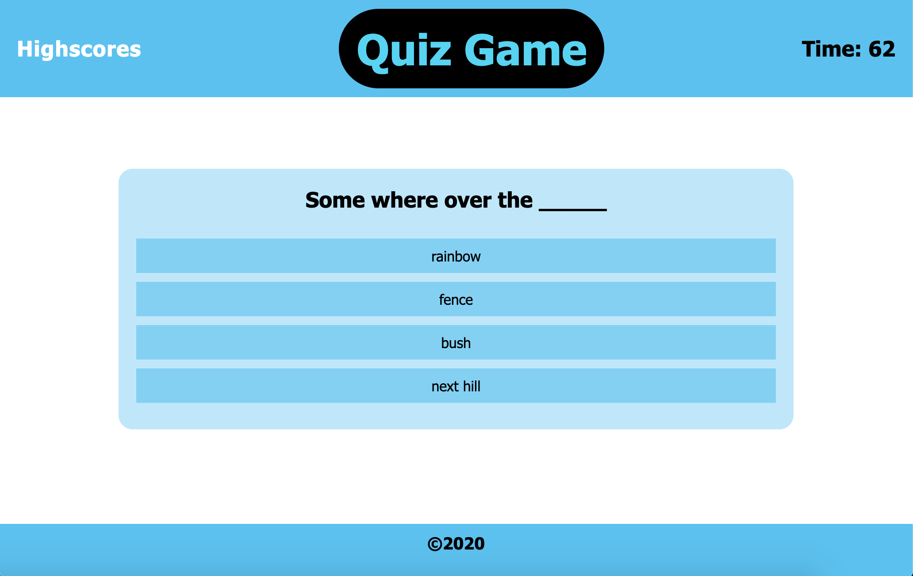

# Project: Quiz Game

&nbsp;  
## Description

This is a small multiple choice quiz game. The user will be presented with a welcome screen and instructions on how to play the game. User clicks the start button to begin the game, a countdown timer is initialized and displayed on screen. User is presented with a series of questions with 4 multiple choice options. User will select/click an answer choice and the next question and answer set will be presented. When all questions have been answered, or the timer has run out, user score is calculated and user can enter their name and be added to the list of persisted scores. 
    
User will be shown leader board modal with the option 
at game end or by clicking on the 'Highscores' link in the navbar. Use will have ability to close leader board modal and clearing currently saved users and scores. 


- Visit the project page:
  https://ehoversten.github.io/quiz_game/

&nbsp;
## Technologies:

* HTML 5
* CSS 3
* CSS Animations
* JavaScript

&nbsp;  
## Usage:





## Instructions

To try out the quiz game simple follow the link: https://ehoversten.github.io/quiz_game/

Want to upload your own question set? 

* Create a new question file (in the project directory "./assets/js")
```javascript
touch question_set.js
```

* Create your own JavaScript Question Object Array by follow the object structure below.

Example structure of Question Set Object Array 
```javascript
var questions = [
    {
        title: "Question #1 Title",
        choices: ["choice_1", "choice_2", "choice_3", "choice_4"],
        answer: "choice_1"
    },
    {
        title: "Question #2 Title",
        choices: ["choice_1", "choice_2", "choice_3", "choice_4"],
        answer: "choice_3"
    },
    ///etc.
];
```

* Update the file path to your new question_set file in the HTML code (index.html)

```html
<script src="./assets/js/<FILE_NAME>.js"></script>
```

&nbsp;   
## Maintainer

- Erik Hoversten

## License:

Licensed under the MIT license.
